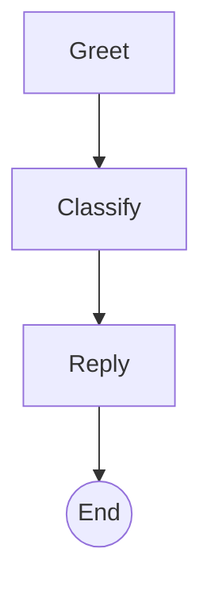
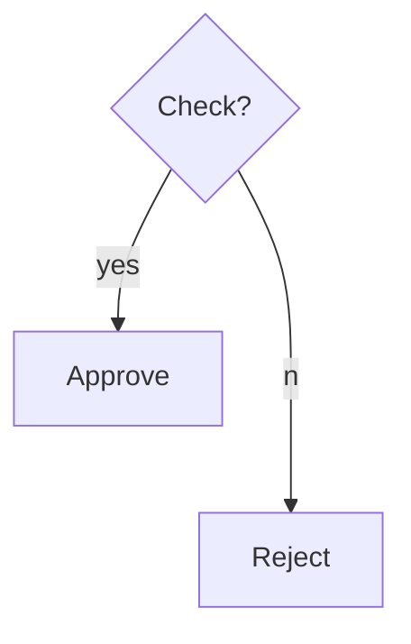
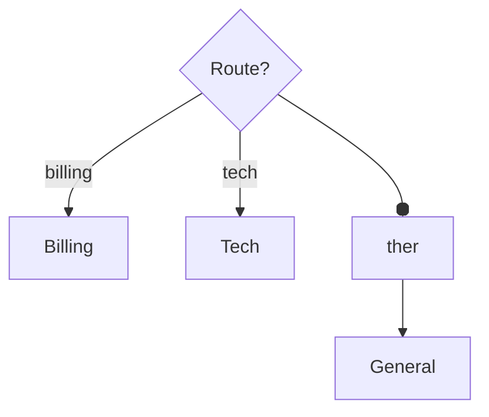
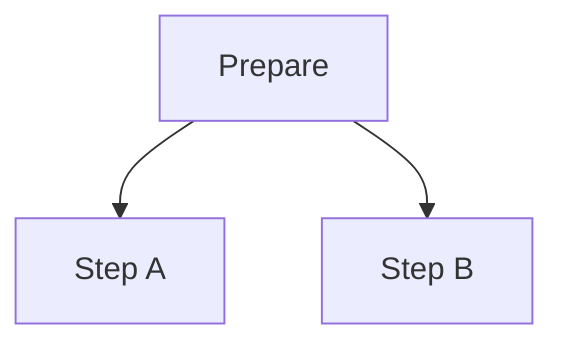
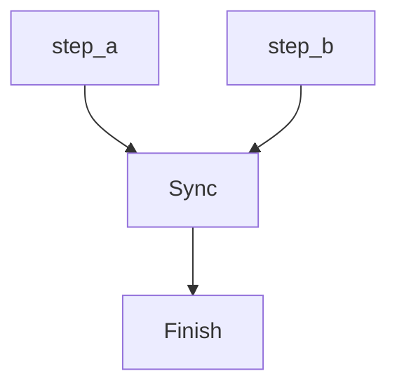
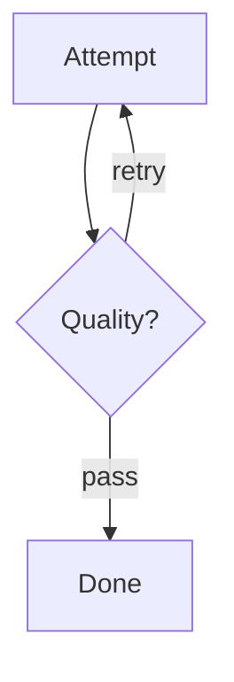
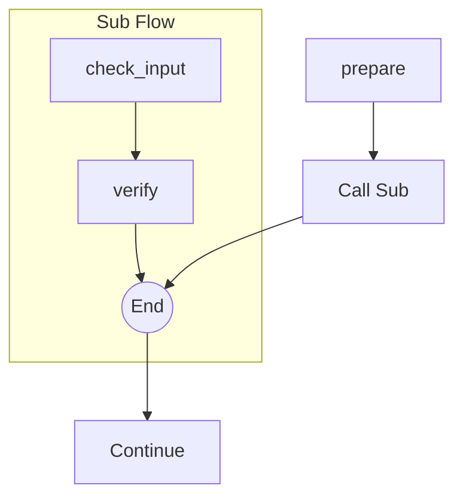
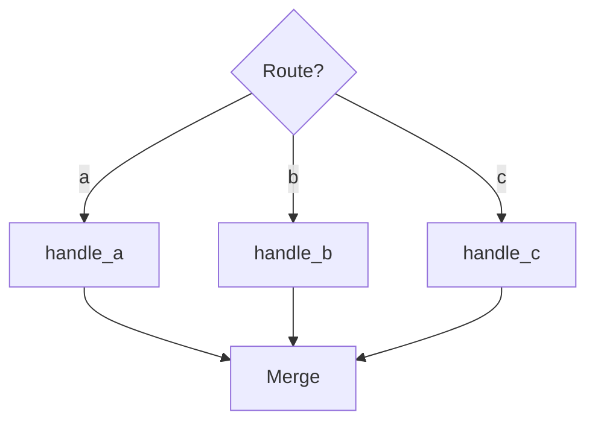
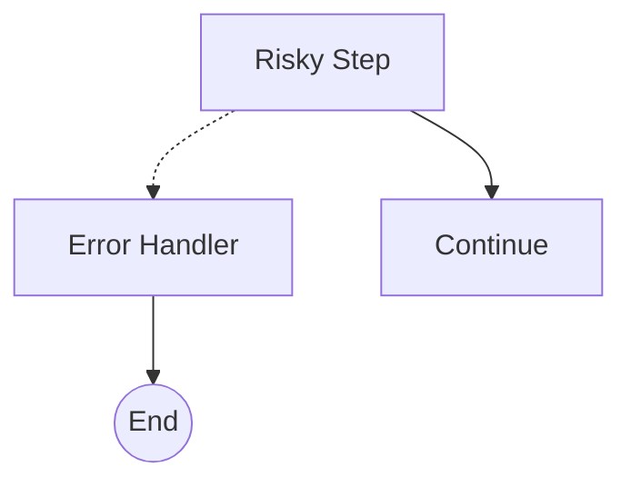

# AISIP vs Mermaid: Control Flow Comparison

## Overview

| Control Structure | Mermaid | AISIP | Notes |
|-------------------|---------|-------|-------|
| Sequential | Yes | Yes | Equivalent |
| If/else (binary) | Yes | Yes | Equivalent |
| Switch (N-way) | Yes | Yes | Equivalent |
| Parallel fork | Yes | Yes | Equivalent |
| Parallel join | Yes | Yes | AISIP more explicit |
| Loop | Yes | Yes | Equivalent |
| Sub-flow (subgraph) | Yes | Yes | AISIP has delegate |
| Convergence (merge) | Yes | Yes | Equivalent |
| Error routing | Partial | Yes | Mermaid can draw `-.->`, AISIP has native `error` field |

---

## Side-by-Side

### 1. Sequential

**Mermaid:**


**AISIP:**
```json
{
  "greet":    { "next": ["classify"] },
  "classify": { "next": ["reply"] },
  "reply":    { "next": ["end"] },
  "end":      {}
}
```

---

### 2. If/Else (Binary Branch)

**Mermaid:**


**AISIP:**
```json
{
  "check": { "branches": { "yes": "approve", "no": "reject" } }
}
```

---

### 3. Switch (N-way Branch)

**Mermaid:**


**AISIP:**
```json
{
  "route": {
    "branches": { "billing": "billing", "tech": "tech", "other": "general" }
  }
}
```

---

### 4. Parallel Fork

**Mermaid:**


**AISIP:**
```json
{
  "prepare": { "next": ["step_a", "step_b"] }
}
```

---

### 5. Parallel Join

**Mermaid:**


**AISIP:**
```json
{
  "step_a": { "next": ["sync"] },
  "step_b": { "next": ["sync"] },
  "sync":   { "wait_for": ["step_a", "step_b"], "next": ["finish"] }
}
```

AISIP advantage: `join` node explicitly declares which nodes to wait for. Mermaid arrows converging on a node are visual only — no waiting semantics.

---

### 6. Loop

**Mermaid:**


**AISIP:**
```json
{
  "attempt": { "next": ["check"] },
  "check":   { "branches": { "retry": "attempt", "pass": "done" } }
}
```

---

### 7. Sub-flow (Delegate)

**Mermaid:**


**AISIP:**

Main task:
```json
{
  "prepare":  { "next": ["call_sub"] },
  "call_sub": { "delegate_to": "validation", "next": ["continue_main"] }
}
```

Sub-task (`validation`):
```json
{
  "check_input": { "next": ["verify"] },
  "verify":      { "next": ["done"] },
  "done":        {}
}
```

AISIP advantage: Sub-tasks are reusable — the same sub-task can be called from multiple delegate nodes. Mermaid subgraphs are visual grouping only.

AISIP also supports step-level sub-task invocation via `RUN aisip.<sub>` in function steps, allowing sub-flows to be called from within function behavior (not visible in the flow graph).

---

### 8. Convergence (Merge)

**Mermaid:**


**AISIP:**
```json
{
  "route":    { "branches": { "a": "handle_a", "b": "handle_b", "c": "handle_c" } },
  "handle_a": { "next": ["merge"] },
  "handle_b": { "next": ["merge"] },
  "handle_c": { "next": ["merge"] },
  "merge":    { "next": ["end"] }
}
```

---

### 9. Error Routing

**Mermaid:**


Mermaid can draw error edges using dotted arrows (`-.->`), but has no semantic distinction between normal and error edges.

**AISIP:**
```json
{
  "risky_step": {
    "next": ["continue"],
    "error": "error_handler"
  },
  "error_handler": {
    "next": ["end"]
  }
}
```

AISIP advantage: The `error` field is a first-class topology concept — the runtime knows this is an error edge, not just a visual connection. Combined with function-level `on_error` (type-based routing), AISIP provides full error handling semantics equivalent to try/catch in programming languages.

---

## Summary

| Dimension | Mermaid | AISIP |
|-----------|---------|-------|
| Purpose | Flow visualization | Structured program definition |
| Machine-readable | Requires parser | Native JSON |
| Error handling | Visual only (`-.->`) | Semantic (`error` field + `on_error`) |
| Parallel join semantics | No (visual only) | Yes (explicit `wait_for`) |
| Sub-flow reuse | No (copy/paste) | Yes (`delegate_to` + `RUN aisip.sub`) |
| Visualization | Native rendering | Convertible to Mermaid |
| Structure/content separation | No | Yes (flow graph + functions) |
| Type-free nodes | N/A | Yes (behavior inferred from structure) |

**Design principle**: AISIP nodes define only topology — what Mermaid can draw. Runtime behavior (join strategy, retry, error type routing, etc.) belongs in functions as RESERVED_KEYS.

AISIP covers all Mermaid control flow capabilities (9/9) and adds semantic error handling, explicit join semantics, and sub-task reuse. Mermaid's advantage is native visualization — but AISIP JSON can be converted to Mermaid for display.
