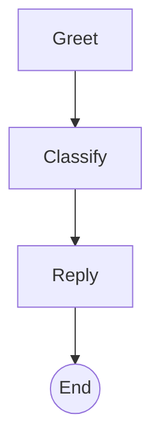
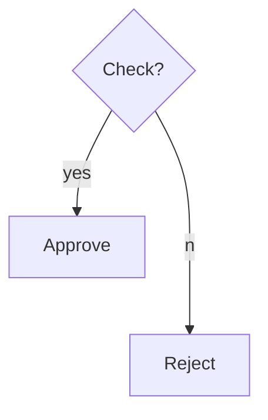
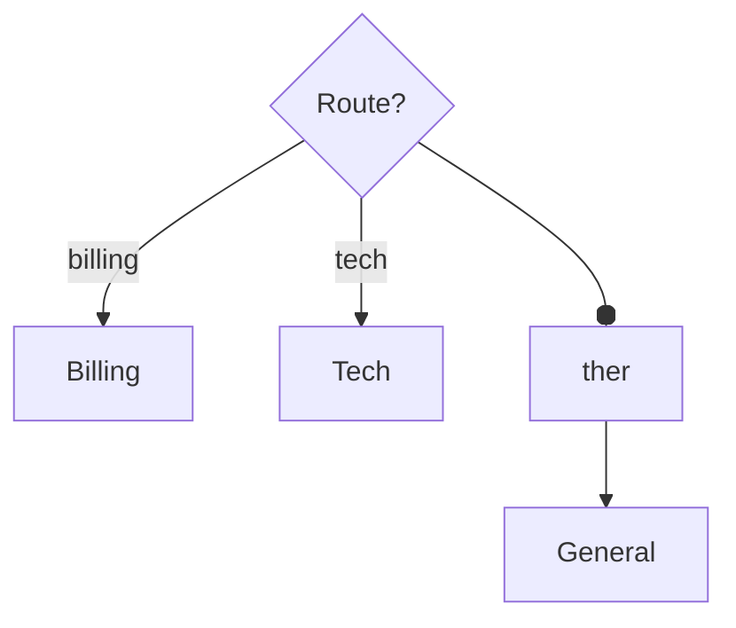
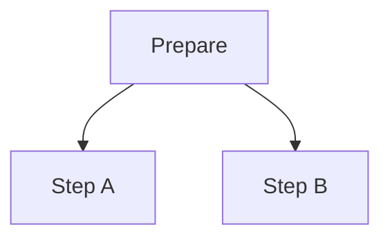
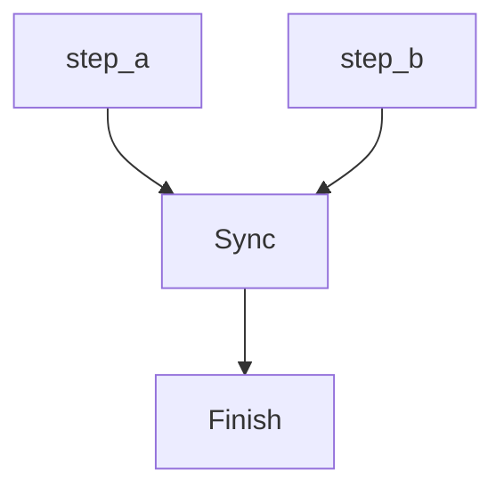
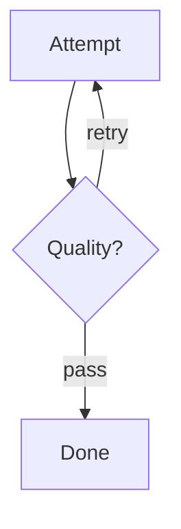
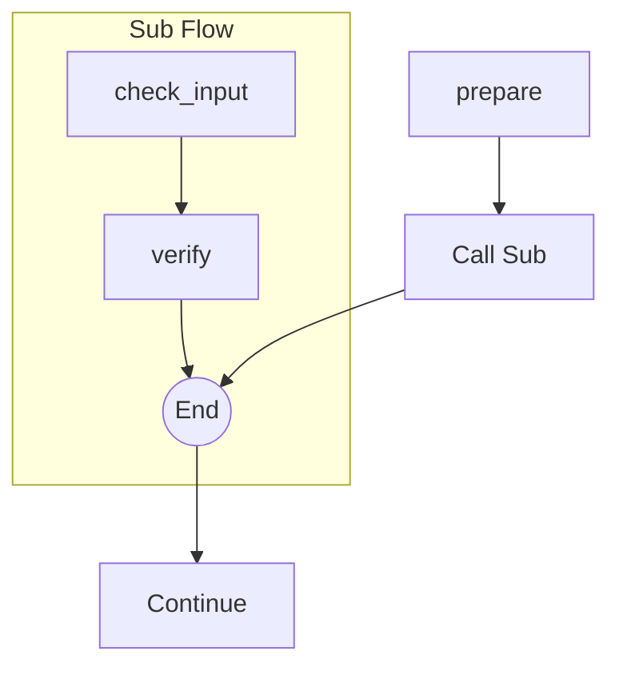
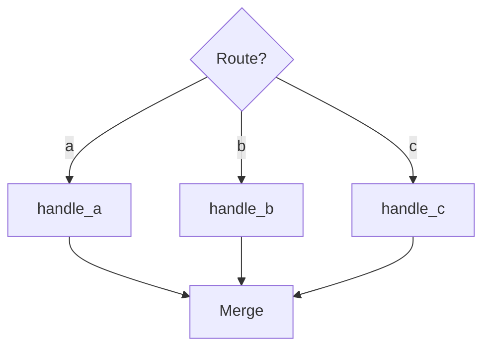
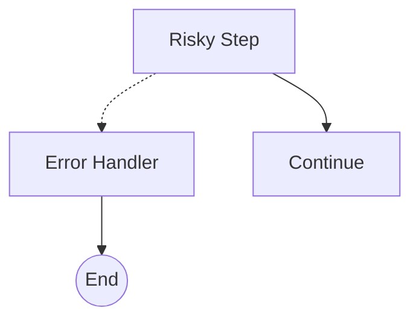

# AISIP vs Mermaid：控制流对比

## 概览

| 控制结构 | Mermaid | AISIP | 备注 |
|---------|---------|-------|------|
| 顺序 | 支持 | 支持 | 等价 |
| 二分支 | 支持 | 支持 | 等价 |
| 多分支 | 支持 | 支持 | 等价 |
| 并行分叉 | 支持 | 支持 | 等价 |
| 并行汇合 | 支持 | 支持 | AISIP 更明确 |
| 回环 | 支持 | 支持 | 等价 |
| 子流程 | 支持 | 支持 | AISIP 有 delegate |
| 收敛 | 支持 | 支持 | 等价 |
| 错误路由 | 部分支持 | 支持 | Mermaid 可画 `-.->`, AISIP 有原生 `error` 字段 |

---

## 逐项对比

### 1. 顺序

**Mermaid：**


**AISIP：**
```json
{
  "greet":    { "next": ["classify"] },
  "classify": { "next": ["reply"] },
  "reply":    { "next": ["end"] },
  "end":      {}
}
```

---

### 2. 二分支

**Mermaid：**


**AISIP：**
```json
{
  "check": { "branches": { "yes": "approve", "no": "reject" } }
}
```

---

### 3. 多分支

**Mermaid：**


**AISIP：**
```json
{
  "route": {
    "branches": { "billing": "billing", "tech": "tech", "other": "general" }
  }
}
```

---

### 4. 并行分叉

**Mermaid：**


**AISIP：**
```json
{
  "prepare": { "next": ["step_a", "step_b"] }
}
```

---

### 5. 并行汇合

**Mermaid：**


**AISIP：**
```json
{
  "step_a": { "next": ["sync"] },
  "step_b": { "next": ["sync"] },
  "sync":   { "wait_for": ["step_a", "step_b"], "next": ["finish"] }
}
```

AISIP 优势：`join` 节点明确声明需要等待的节点。Mermaid 中箭头汇聚到某节点仅是视觉效果 — 没有等待语义。

---

### 6. 回环

**Mermaid：**


**AISIP：**
```json
{
  "attempt": { "next": ["check"] },
  "check":   { "branches": { "retry": "attempt", "pass": "done" } }
}
```

---

### 7. 子流程（Delegate）

**Mermaid：**


**AISIP：**

主任务：
```json
{
  "prepare":  { "next": ["call_sub"] },
  "call_sub": { "delegate_to": "validation", "next": ["continue_main"] }
}
```

子任务（`validation`）：
```json
{
  "check_input": { "next": ["verify"] },
  "verify":      { "next": ["done"] },
  "done":        {}
}
```

AISIP 优势：子任务可复用 — 同一子任务可以被多个 delegate 节点调用。Mermaid 的 subgraph 仅是视觉分组。

AISIP 还支持步骤层子任务调用，通过函数步骤中的 `RUN aisip.<sub>` 实现，允许在函数行为内调用子流程（不在流程图中显示）。

---

### 8. 收敛

**Mermaid：**


**AISIP：**
```json
{
  "route":    { "branches": { "a": "handle_a", "b": "handle_b", "c": "handle_c" } },
  "handle_a": { "next": ["merge"] },
  "handle_b": { "next": ["merge"] },
  "handle_c": { "next": ["merge"] },
  "merge":    { "next": ["end"] }
}
```

---

### 9. 错误路由

**Mermaid：**


Mermaid 可以使用虚线箭头（`-.->`）画出错误边，但没有正常边和错误边的语义区别。

**AISIP：**
```json
{
  "risky_step": {
    "next": ["continue"],
    "error": "error_handler"
  },
  "error_handler": {
    "next": ["end"]
  }
}
```

AISIP 优势：`error` 字段是一等拓扑概念 — 运行时知道这是错误边，不仅仅是视觉连接。配合函数层的 `on_error`（类型路由），AISIP 提供了等同于编程语言 try/catch 的完整错误处理语义。

---

## 总结

| 维度 | Mermaid | AISIP |
|------|---------|-------|
| 用途 | 流程可视化 | 结构化程序定义 |
| 机器可读 | 需要解析器 | 原生 JSON |
| 错误处理 | 仅视觉（`-.->`） | 语义化（`error` 字段 + `on_error`） |
| 并行汇合语义 | 不支持（仅视觉） | 支持（明确的 `wait_for`） |
| 子流程复用 | 不支持（复制粘贴） | 支持（`delegate_to` + `RUN aisip.sub`） |
| 可视化 | 原生渲染 | 可转换为 Mermaid 显示 |
| 结构/内容分离 | 不支持 | 支持（流程图 + 函数） |
| 无 type 节点 | 不适用 | 支持（行为从结构推断） |

**设计原则**：AISIP 节点只定义拓扑 — Mermaid 能画出来的。运行时行为（join 策略、重试、错误类型路由等）属于函数层的 RESERVED_KEYS。

AISIP 覆盖了 Mermaid 的所有控制流能力（9/9），并增加了语义化错误处理、明确的汇合语义和子任务复用。Mermaid 的优势是原生可视化 — 但 AISIP JSON 可以转换为 Mermaid 进行展示。
